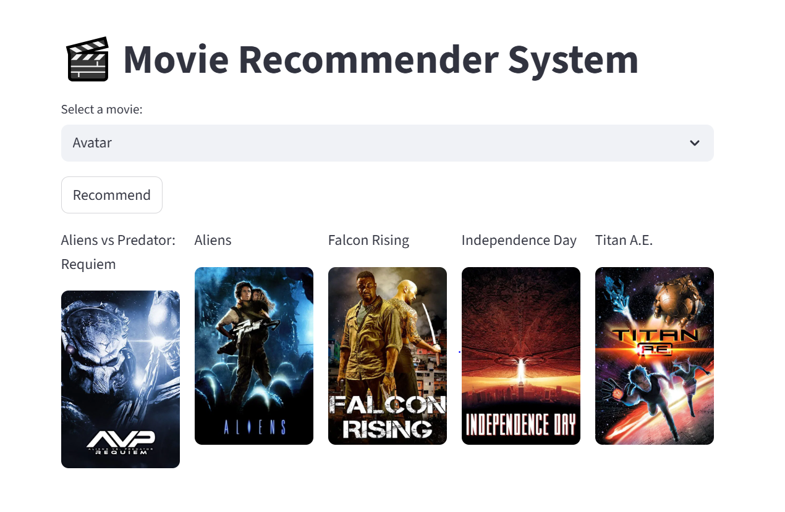

## 🎬 Movie Recommender System

A simple **Movie Recommender System** built with **Python** and deployed using **Streamlit**.  
The system suggests movies similar to the one selected by the user, making it easier to discover new movies.  

This project demonstrates the use of **content-based recommendation** and how to deploy ML apps using Streamlit.

---

 ## Demonstration of the app:  

---

##  Project Overview

This project shows how **recommendation systems** work using movie data.  
It uses **cosine similarity** on features like genres, cast, crew, and keywords to recommend movies that are most similar to the selected one.  

The recommender is wrapped in a **Streamlit app** for an interactive and user-friendly interface.

---

##  Features

-  Get **movie recommendations** instantly  
-  Uses **content-based filtering** with cosine similarity  
-  Interactive **Streamlit web app**  
  

---

## Project Workflow

- Data Collection & Preprocessing
   - Collected movie dataset (titles, genres, ratings, user history).
   - Cleaned data (handled missing values, normalized features).
- Feature Engineering
   - Extracted features such as movie genres, keywords, cast, director, and user ratings.
- Model Building
   - Implemented Content-Based Filtering (recommend movies similar to a given one).
   - Implemented Collaborative Filtering (recommend based on user–user or item–item similarities).
- Evaluation
   - Used metrics like Precision@K, Recall@K to evaluate performance.
- Deployment
   - Built a simple Streamlit where users can search for a movie and get recommendations instantly.ows.

---

## Real-World Applications

Movie recommender systems are widely used in the entertainment industry:

- OTT Platforms (Netflix, Amazon Prime, Disney+)
   - Personalize user experience by suggesting movies/shows based on past viewing behavior.

- Online Movie Databases (IMDb, TMDb)
   - Help users discover similar movies or trending recommendations.

- Cinema & Ticket Booking Apps
   - Suggest movies currently running in theaters based on user interests.

- Content Creators & Studios  
   - Understand audience preferences and plan new content accordingly.
